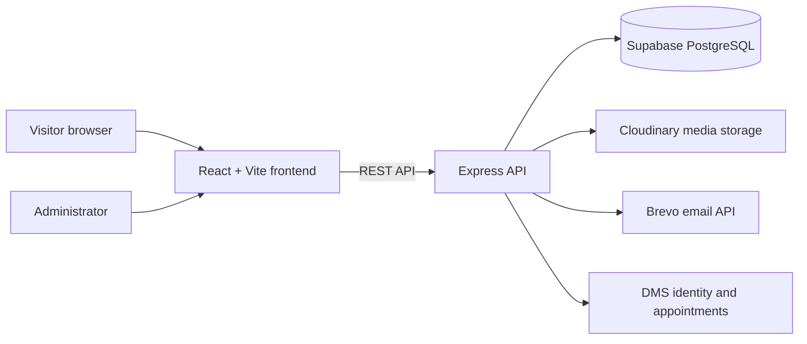

# MUTCU Website

The official digital home of the **Murang'a University of Technology Christian Union (MUTCU)**. The website helps students and visitors discover the Union, connect with ministries, follow events, read stories, access resources, submit prayer requests, and get in touch with the leadership team.

**Live website:** [mutcu.org](https://mutcu.org)  
**Member portal:** [portal.mutcu.org](https://portal.mutcu.org)

> *Inspire Love, Hope & Godliness.*

## Overview

MUTCU is a content-driven React website with a protected administration area. Public content is served through a Node.js API and stored in Supabase. Administrators can manage the content that appears on the public site without changing frontend code.

### What visitors can do

- Explore the Union's vision, story, ministries, committees, and leadership.
- View upcoming events, featured announcements, blogs, and photo galleries.
- Browse sermons, devotionals, forms, and other ministry resources.
- Register interest in MUTCU and subscribe to updates.
- Send a message or submit a private or public prayer request.

### What administrators can do

The dashboard at `/admin` provides tools to manage:

- Homepage content and site settings
- Leadership profiles and ministry information
- Events and announcements
- Blog posts with rich text editing
- Gallery images and Cloudinary uploads
- Resources and downloadable links
- Contact submissions and prayer requests
- Newsletter subscribers
- Dashboard analytics

## Architecture



| Layer | Technology | Responsibility |
| --- | --- | --- |
| Frontend | React 18, React Router, Vite, TailwindCSS | Public pages, admin dashboard, responsive UI |
| UI | Lucide React, AOS, React Hot Toast | Icons, animations, notifications |
| Editor | Tiptap | Rich blog and content editing |
| Backend | Node.js, Express | REST API, validation, auth, rate limiting |
| Database | Supabase PostgreSQL | Website content and submissions |
| Authentication | JWT | Admin sessions shared with the DMS |
| Media | Cloudinary | Image uploads and hosted media |
| Email | Brevo HTTP API | Contact, notification, and newsletter workflows |
| Hosting | Vercel + Render | Frontend and backend deployment |

## Repository layout

```text
mutcu-website/
├── backend/
│   ├── src/
│   │   ├── db/schema.sql       # Supabase tables, policies, and seed data
│   │   ├── lib/                # Supabase, Cloudinary, and email clients
│   │   ├── middleware/         # JWT authentication middleware
│   │   ├── routes/             # API route modules
│   │   └── index.js            # Express application entry point
│   └── package.json
├── frontend/
│   ├── public/assets/          # Static image assets
│   ├── src/
│   │   ├── components/         # Shared UI components
│   │   ├── context/            # Authentication context
│   │   ├── layouts/            # Public and admin layouts
│   │   ├── lib/api.js          # Frontend API client
│   │   └── pages/              # Public, ministry, committee, and admin pages
│   ├── vite.config.js
│   └── package.json
├── .gitignore
└── README.md
```

## Prerequisites

- Node.js 18 or newer
- npm 9 or newer
- A Supabase project
- Cloudinary credentials for image uploads
- Brevo credentials for email features
- Access to the shared DMS authentication configuration

## Local development

### 1. Install dependencies

Install each application independently because the repository does not use a root npm workspace:

```bash
cd backend
npm install

cd ../frontend
npm install
```

### 2. Configure Supabase

Open the Supabase SQL Editor for the project shared with the DMS and run:

```text
backend/src/db/schema.sql
```

The schema creates the website tables, enables row-level security, adds service-role access policies, and seeds the default ministries and testimonials.

### 3. Configure the backend

Create `backend/.env` locally. Never commit this file.

```dotenv
PORT=5001
NODE_ENV=development
FRONTEND_URL=http://localhost:5173

SUPABASE_URL=https://your-project.supabase.co
SUPABASE_ANON_KEY=your-anon-key
SUPABASE_SERVICE_KEY=your-service-role-key

JWT_SECRET=the-shared-dms-jwt-secret
JWT_EXPIRES_IN=7d

BREVO_API_KEY=your-brevo-api-key
MAIL_FROM_EMAIL=noreply@example.com
MAIL_FROM_NAME=MUTCU Website
MAIL_REPLY_TO=admin@example.com
ADMIN_EMAIL=admin@example.com

CLOUDINARY_CLOUD_NAME=your-cloud-name
CLOUDINARY_API_KEY=your-cloudinary-api-key
CLOUDINARY_API_SECRET=your-cloudinary-api-secret
```

Start the API:

```bash
cd backend
npm run dev
```

The development API runs on `http://localhost:5001`. Confirm it is available at [`/health`](http://localhost:5001/health).

### 4. Configure and start the frontend

The Vite development proxy forwards `/api` requests to the local backend. If the frontend needs to call a deployed API directly, create `frontend/.env` and set:

```dotenv
VITE_API_URL=https://your-api.example.com
```

Then start the frontend:

```bash
cd frontend
npm run dev
```

Open `http://localhost:5173` in a browser. The frontend is configured to use port `5173` and the API proxy is configured for port `5001`.

## Available scripts

### Frontend

| Command | Purpose |
| --- | --- |
| `npm run dev` | Start the Vite development server |
| `npm run build` | Create a production build in `dist/` |
| `npm run preview` | Preview the production build locally |

### Backend

| Command | Purpose |
| --- | --- |
| `npm run dev` | Start the API with Nodemon |
| `npm start` | Start the API with Node.js |

## Application routes

### Public routes

| Route | Purpose |
| --- | --- |
| `/` | Homepage |
| `/about` | About MUTCU and current leadership |
| `/ministries` | Ministry directory |
| `/ministries/:ministry` | Ministry detail pages |
| `/committees/:role` | Executive and coordinator profiles |
| `/special-committees` | Special committee directory |
| `/events` | Events and programmes |
| `/blogs` and `/blogs/:slug` | Blog listing and article pages |
| `/gallery` | Media gallery |
| `/resources` | Ministry resources |
| `/contact` | Contact form and contact details |
| `/register` | Registration and interest form |

### Admin routes

| Route | Purpose |
| --- | --- |
| `/admin/login` | Administrator sign-in |
| `/admin` | Dashboard overview |
| `/admin/analytics` | Content and activity analytics |
| `/admin/homepage` | Homepage content |
| `/admin/leadership` | Leadership profiles |
| `/admin/events` | Events |
| `/admin/blogs` | Blog posts |
| `/admin/gallery` | Gallery media |
| `/admin/resources` | Resources |
| `/admin/ministries` | Ministries |
| `/admin/contacts` | Contact submissions |
| `/admin/prayer` | Prayer requests |
| `/admin/newsletter` | Newsletter subscribers |
| `/admin/settings` | Site settings |

## API surface

The backend exposes the following route groups under `/api`:

```text
/api/admin
/api/leadership
/api/events
/api/blogs
/api/gallery
/api/resources
/api/prayer
/api/newsletter
/api/contact
/api/ministries
/api/settings
```

Public content endpoints are available to the website. Mutating admin endpoints require a valid JWT from the shared DMS authentication system. The API also uses Helmet, CORS allow-listing, general rate limiting, and stricter limits for contact, prayer, and newsletter submissions.

## Authentication and data flow

Admin users sign in at `/admin/login` using their DMS credentials. The website accepts the roles configured by the DMS, including `super_admin`, `ec_admin`, and `cu_secretary`, and signs requests with the shared JWT secret.

Leadership can be sourced from the DMS appointments data and supplemented with website-specific profile fields in `website_leadership`. Website-owned content is stored in tables prefixed with `website_` so it can coexist with the DMS schema.

## Deployment

### Backend on Render

1. Create a Render Web Service connected to the repository.
2. Set the root directory to `backend`.
3. Use `npm install` as the build command.
4. Use `npm start` as the start command.
5. Add every backend variable from the environment reference above.
6. Set `FRONTEND_URL` to the deployed frontend origin.

### Frontend on Vercel

1. Create a Vercel project connected to the repository.
2. Set the root directory to `frontend`.
3. Use `npm run build` as the build command.
4. Set the output directory to `dist`.
5. Set `VITE_API_URL` to the deployed Render API URL.
6. Add the deployed frontend origin to the backend CORS allow-list if it is not already covered by `FRONTEND_URL`.

## Security notes

- Environment files are intentionally ignored by Git. Keep all API keys, service-role keys, JWT secrets, and Cloudinary secrets outside the repository.
- Never expose `SUPABASE_SERVICE_KEY`, `JWT_SECRET`, or `CLOUDINARY_API_SECRET` in frontend code or public logs.
- Use the Supabase service key only from the backend.
- Rotate credentials immediately if an environment file is ever committed or shared.
- Use HTTPS for production frontend, API, database, and media traffic.
- Review Supabase policies before changing the data model or exposing a new public endpoint.

## Contribution workflow

1. Create a feature branch.
2. Run the backend and frontend locally.
3. Test the affected public or admin workflow in the browser.
4. Run `npm run build` from `frontend` before opening a pull request.
5. Keep secrets in local environment files and include configuration changes in the documentation.

## License and ownership

This project is maintained for Murang'a University of Technology Christian Union. Contact the MUTCU leadership or project maintainers before reusing the branding, content, media, or deployment configuration.